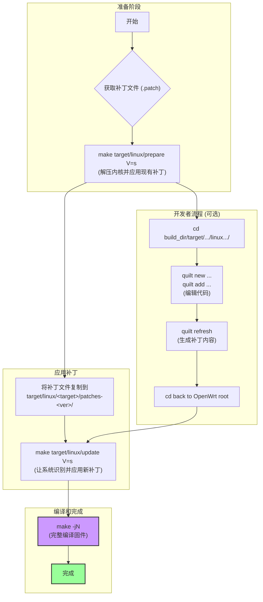

# 在 OpenWrt 中为 Linux 内核打补丁

在 OpenWrt 编译框架中为 Linux 内核打补丁，通常有两种情况：一是你已经有了一个现成的补丁文件（`.patch`），二是你需要直接修改内核源码然后生成补丁。正确的方式是使用 OpenWrt 的补丁管理系统（quilt），这样你的修改就不会在清理或更新源码时丢失。

下面我将分别介绍这两种情况的操作流程。

---

## 场景一：应用一个已有的补丁文件

这是最常见和最简单的情况。假设你已经有了一个名为 `my-kernel-fix.patch` 的补丁文件。

1.  **准备内核源码树**
    首先，需要让 OpenWrt 构建系统解压内核源码并应用所有已有的官方补丁。
    ```bash
    # V=s 参数会输出详细的日志，方便定位内核源码目录
    make target/linux/prepare V=s
    ```
    执行此命令后，内核源码会被解压到 `build_dir/` 下的一个目录中（例如 `build_dir/target-x86_64_musl/linux-x86_64/linux-6.1.82/`），并且所有官方补丁都已应用。

2.  **找到并进入内核补丁目录**
    OpenWrt 的内核补丁存放在 `target/linux/<target_name>/patches-<kernel_version>/` 目录下。
    *   `<target_name>` 是你在 `make menuconfig` 中选择的目标平台（如 `x86`, `ramips`, `ath79`）。
    *   `<kernel_version>` 是该平台使用的内核版本（如 `6.1`）。

    例如，如果你编译的是 `x86/64` 平台，内核版本是 `6.1`，那么目录就是 `target/linux/x86/patches-6.1/`。

3.  **复制你的补丁文件**
    将你的 `.patch` 文件复制到上述目录。为了确保你的补丁在所有官方补丁之后应用，推荐使用 `999-` 这样的高数字前缀。
    ```bash
    # 示例路径
    cp /path/to/your/my-kernel-fix.patch target/linux/x86/patches-6.1/999-my-kernel-fix.patch
    ```

4.  **更新内核补丁列表**
    执行以下命令，让构建系统知道你添加了一个新补丁。
    ```bash
    make target/linux/update V=s
    ```
    这个命令会刷新补丁列表，并尝试应用你的新补丁。如果有冲突，它会报错。

5.  **开始编译**
    现在，你的补丁已经正式成为构建的一部分了。正常编译即可。
    ```bash
    # 使用 -jN 加速编译，N 通常是你的 CPU 核心数 + 1
    make -j$(nproc)
    ```

---

## 场景二：直接修改源码并生成补丁

如果你想自己开发功能或修复 bug，可以按以下流程操作。

1.  **准备内核源码树**
    和场景一一样，先执行：
    ```bash
    make target/linux/prepare V=s
    ```

2.  **进入内核源码目录并修改**
    根据上一步的输出日志，`cd` 到 `build_dir/` 下的内核源码目录。
    ```bash
    # 这是一个示例路径，请根据你的实际情况调整
    cd build_dir/target-x86_64_musl/linux-x86_64/linux-6.1.82/
    ```

3.  **使用 `quilt` 管理你的修改**
    `quilt` 是 OpenWrt 使用的补丁管理工具。
    ```bash
    # 1. (可选) 查看所有已应用的补丁
    quilt series

    # 2. 创建一个新补丁并命名
    quilt new 999-my-new-feature.patch

    # 3. 将你要修改的文件添加到这个新补丁中
    #    例如，你要修改 drivers/net/ethernet/intel/e1000e/netdev.c
    quilt add drivers/net/ethernet/intel/e1000e/netdev.c

    # 4. 现在用你喜欢的编辑器修改这个文件
    vim drivers/net/ethernet/intel/e1000e/netdev.c
    # ... 进行你的代码修改 ...

    # 5. 修改完成后，刷新补丁，将你的改动保存到 .patch 文件中
    quilt refresh
    ```
    现在，你的修改已经被记录在 `patches/999-my-new-feature.patch` 文件里了。

4.  **将新补丁同步回 OpenWrt 源码树**
    首先，回到 OpenWrt 的根目录：
    ```bash
    cd - # 或者 cd /path/to/your/openwrt
    ```
    然后执行 `update` 命令，这个命令会自动把你在 `build_dir` 中创建的补丁复制回 `target/linux/<target_name>/patches-<kernel_version>/` 目录。
    ```bash
    make target/linux/update V=s
    ```

5.  **开始编译**
    你的修改已经作为一个独立的补丁被永久保存了。现在可以正常编译你的固件。
    ```bash
    make -j$(nproc)
    ```

---

## 流程图

为了让你更直观地理解，下面是一个流程图，总结了上述步骤。


